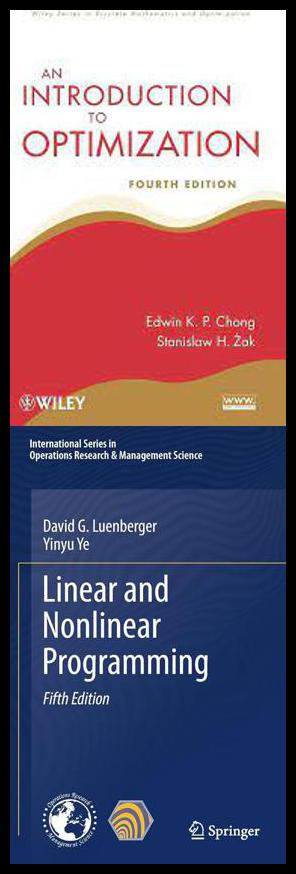

# CC0323: Programação Não-Linear
Michael Souza

*michael@ufc.br*

*(85) 99821-9955*

---
## Visão Geral

- **Código**: CC0323
- **Semestre**: 6º
- **Carga Horária**: 64 (48 Teórica, 16 Prática)
- **Pré-Requisitos**: Cálculo II, Álgebra Linear
- **Horário**: Quartas e Sextas de 10h às 11h40

---

## Descrição do Curso

- Revisão de conceitos matemáticos
    - Derivadas (Gradiente, Hessiana, ...)
    - Série de Taylor
- Condições de otimalidade local
- Convexidade
- Otimização unidimensional
- Otimização multidimensional irrestrita
- Otimização multidimensional restrita

---

## Bibliografia Básica

1. E.K.P. Chong, S.H. Zak. *An Introduction to Optimization*, 3ª Ed. Wiley-Interscience, 2008.
2. D. G. Luenberger, Y. Ye. *Linear and Nonlinear Programming*, 3ª Ed. Springer, 2008.
3. R. Fletcher. *Métodos Práticos de Otimização*. Wiley, 2000.

---

## Bibliografia Complementar

1. A. Friedlander. *Elementos de Programação Não-Linear*. Unicamp, 1994.
2. A. Izmailov, M. Solodov. *Otimização Vol. 1: Condições de Otimalidade, Elementos de Análise Convexa e de Dualidade*. IMPA, 2005.
3. A. Izmailov, M. Solodov. *Otimização Vol. 2: Métodos Computacionais, Elementos de Análise Convexa e de Dualidade*. IMPA, 2007.
4. M. S. Bazaraa, Hanif D. Sherali, C. M. Shetty. *Programação Não Linear: Teoria e Algoritmos*. Wiley-Interscience, 2006.
5. Dimitri P. Bertsekas. *Programação Não Linear*. Athena Scientific, 1999.

---

## Avaliação

- **Provas**: 3 provas teóricas (P1, P2, P3)
- **Trabalhos**: 2 trabalhos práticos (T1, T2)

 

A média final será calculada como:
 

$$ MF = 0.6 \times \frac{P1 + P2 + P3}{3} + 0.4 \times \frac{T1 + T2}{2} $$

---

<!-- _class: lead -->
## Conteúdo das avaliações
 

| Prova | Conteúdo |
|:-----:|----------|
| P1    | - Revisão de conceitos matemáticos - Condições de otimalidade local - Otimização unidimensional |
| P2    | - Otimização multidimensional irrestrita - Convexidade |
| P3    | - Otimização com restrições |

---

## Conteúdo dos Trabalhos

- **T1**: Resolução de um problema prático de otimização irrestrita
    - Código
    - Apresentação (5 slides)
    
- **T2**: Resolução de um problema prático de otimização restrita
    - Código
    - Apresentação (5 slides)

---

# Perguntas?
