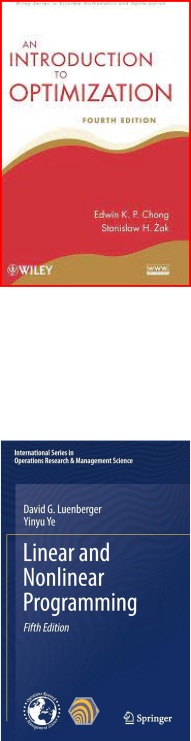

# CC0323: Programação Não-Linear
Michael Souza

*michael@ufc.br*

---
## Visão Geral

- **Código**: CC0323
- **Semestre**: 6º
- **Carga Horária**: 64 (48 Teórica, 16 Prática)
- **Pré-Requisitos**: Cálculo II, Álgebra Linear
- **Horário**: Quartas e Sextas de 10h às 11h40

---

## Ementa

- Revisão de conceitos matemáticos
    - Derivadas (Gradiente, Hessiana, ...)
    - Série de Taylor
- Condições de otimalidade local
- Convexidade
- Otimização unidimensional
- Otimização multidimensional irrestrita
- Otimização multidimensional restrita

---

## Bibliografia Básica

1. ***E.K.P. Chong, S.H. Zak. *An Introduction to Optimization*, 4ª Ed. Wiley, 2013.***
2. D. G. Luenberger, Y. Ye. *Linear and Nonlinear Programming*, 5ª Ed. Springer, 2021.
3. R. Fletcher. *Practical Methods of Optimization*, 2ª Ed. Wiley, 2013.

---

## Bibliografia Complementar

1. A. Friedlander. *Elementos de Programação Não-Linear*. Unicamp, 1994.
2. A. Izmailov, M. Solodov. *Otimização Vol. 1: Condições de Otimalidade, Elementos de Análise Convexa e de Dualidade*. IMPA, 2005.
3. A. Izmailov, M. Solodov. *Otimização Vol. 2: Métodos Computacionais, Elementos de Análise Convexa e de Dualidade*. IMPA, 2007.
4. M. S. Bazaraa, H. D. Sherali, C. M. Shetty. *Nonlinear Programming: Theory and Algorithms*. Wiley, 2006.
5. Dimitri P. Bertsekas. *Nonlinear Programming*. Athena Scientific, 1999.

---

## Avaliação

- **Provas**: 3 provas teóricas ($P_1, P_2, P_3$)
- **Trabalhos**: 2 trabalhos práticos ($T_1, T_2$)

 

A média final será dada por:
 

$$ M_F = 0.6 \times \frac{P_1 + P_2 + P_3}{3} + 0.4 \times \frac{T_1 + T_2}{2} $$

---

<!-- _class: lead -->
## Conteúdo das avaliações
 

| Prova | Conteúdo |
|:-----:|----------|
| $P_1$ | - Revisão de conceitos matemáticos - Condições de otimalidade local - Otimização unidimensional |
| $P_2$ | - Otimização multidimensional irrestrita - Convexidade |
| $P_3$ | - Otimização com restrições |

---

## Conteúdo dos Trabalhos

- **$T_1$**: Resolução de um problema prático de otimização irrestrita
    - Código (Jupyter Notebook, Python)
    - Apresentação (5 slides: Intro, Problema, Método, Resultados, Conclusão)
    
- **$T_2$**: Resolução de um problema prático de otimização restrita
    - Código (Jupyter Notebook, Python)
    - Apresentação (5 slides: Intro, Problema, Método, Resultados, Conclusão)

--- 

## Canais de Comunicação

- **Aulas**
    - Dúvidas em aula (primeiros 15 minutos)    

- **E-mail**: 
    - *michael@ufc.br*
    - Assunto: [CC0323] Assunto do e-mail    

- **WhatsApp:** 
  - Grupo: *CC0323-2024.1* (*QR Code* :point_right:)
  
- **Google Classroom**
    - Material de aula, Trabalhos (*Link no WhatsApp*)
    

---

# Perguntas?
