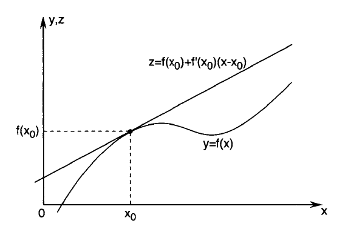

# CC0323: Elementos de Cálculo
Michael Souza

*michael@ufc.br*

---

## O que é uma derivada?

---
### Norma de um vetor

A norma de um vetor $x = (x_1, x_2, \ldots, x_n)$ no espaço euclidiano $\mathbb{R}^n$ é dada por:

$$\|x\| = \sqrt{\sum_{i=1}^n x_i^2}$$

**Exemplo**:

Em  $\mathbb{R}^2$, para $x = (3, 4)$, temos $\|x\| = \sqrt{3^2 + 4^2} = 5$.

Em $\mathbb{R}$, a norma é dada por $\|x\| = |x|$ (módulo).

---

### Distância Norma-Induzida

Toda norma em $\mathbb{R}^n$ induz uma métrica, que é a distância entre dois pontos $x$ e $y$ dada por:

$$d(x, y) = \|x - y\|$$

**Exemplo**:

Em $\mathbb{R}^2$, a distância entre $x = (x_1, x_2)$ e $y = (y_1, y_2)$ é dada por:

$$d(x, y) = \sqrt{(x_1 - y_1)^2 + (x_2 - y_2)^2}$$

Para $x=(3, 4)$ e $y=(1, 3)$, temos $d(x, y) = \sqrt{(3-1)^2 + (4-3)^2} = \sqrt{5}$.

---
## Sequências e Limites

### Sequência de números reais	

Uma sequência de números reais é uma função $a: \mathbb{N} \to \mathbb{R}$, onde $n \in \mathbb{N}$ e $a(k) \in \mathbb{R}$.

**Exemplo**: 

A sequência gerada por $a(k) = 1/k$ é dada por $\{1, 1/2, 1/3, 1/4, \ldots\}.$

---
### Limite

Dizemos que a sequência $a(k)$ converge para o número real $L$ se, para todo $\epsilon > 0$, existe um número natural $k_0$ tal que $|a(k) - L| < \epsilon$ para todo $k \geq k_0$.

Escrevemos de modo abreviado:
$$\lim_{k \to \infty} a(k) = L\;\;\text{ou} \;\;a_k \to L$$

**Exemplo**:

A sequência $a_k = 1/k$ converge para $L = 0$.

---

### Teorema
Uma sequência convergente tem um único limite.

**Prova:** Por contradição, suponha que $a_k \to L$ e $a_k \to M$. Então, para $\epsilon = |L - M|/2$, existem $k_1$ e $k_2$ tais que $|a_k - L| < \epsilon$ e $|a_k - M| < \epsilon$ para $k \geq k_1$ e $k \geq k_2$, respectivamente.

---

### Teorema
Toda sequência convergente é limitada.

**Prova:** Se $a_k \to L$, então existe $k_0$ tal que $|a_k - L| < 1$ para $k \geq k_0$. Assim, para $k \geq k_0$, temos $|a_k| = |a_k - L + L| \leq |a_k - L| + |L| < 1 + |L|$. Portanto, $|a_k| < 1 + |L|$ para $k \geq k_0$.

Agora, tome $M = \max\{|a_1|, |a_2|, \ldots, |a_{k_0-1}|, 1 + |L|\}$. Então, $|a_k| \leq M$ para todo $k \in \mathbb{N}$.

---
### Supremo (Ínfimo)

Seja $A \subset \mathbb{R}$ um conjunto não vazio e limitado superiormente. O número real $L$ é o **supremo** de $A$, denotado por $L = \sup\{A\}$, se:
1. $L$ é um limitante superior de $A$
2. Para todo $\epsilon > 0$, existe $a \in A$ tal que $L - \epsilon < a \leq L$

**Exemplo:** 

a) $\sup\{1/n\} = 0$

b) $\sup\{1 - 1/n\} = 1$

c) $\sup\{\cos(x)\} = 1$

---

### Teorema

Toda sequência monótona limitada em $\mathbb{R}$ é convergente.

**Prova:** Seja $a_k$ uma sequência monótona crescente e limitada. Então, existe $L = \sup\{a_k\}$. Dado $\epsilon > 0$, existe $k_0$ tal que $L - \epsilon < a_{k_0} \leq L$. Como $a_k$ é crescente, temos $L - \epsilon < a_k \leq L$ para $k \geq k_0$. Portanto, $a_k \to L$.

---

## Diferenciabilidade

O cálculo diferencial é baseado na ideia de aproximar uma função qualquer $f:\mathbb{R}^n\to\mathbb{R}^m$ por uma função afim $\mathcal{A}$.

### Função Afim

Uma função $\mathcal{A}: \mathbb{R}^n \to \mathbb{R}^m$ é afim se existe uma matriz $A \in \mathbb{R}^{m \times n}$ e um vetor $b \in \mathbb{R}^m$ tais que:

$$\mathcal{A}(x) = Ax + b, \;\;x \in \mathbb{R}^n$$

---

Desejamos encontrar a melhor aproximação afim $\mathcal{A}$ para $f$ em um ponto $x_0$.

Primeiro, impomos a condição natural de que $\mathcal{A}(x_0) = f(x_0)$ e obtemos 

$$\mathcal{A}(x_0) = Ax_0 + b = f(x_0) \Rightarrow b = f(x_0) - Ax_0$$

 

Pela linearidade de $A$, temos que 

$$\mathcal{A}(x) + b = Ax + f(x_0) - Ax_0 = A(x - x_0) + f(x_0)$$

Agora, exigimos que $\mathcal{A}(x)$ se aproxime de $f(x)$ mais rápido que $x$ se aproxima de $x_0$,
 

$$\lim_{x \to x_0} \frac{\|f(x) - \mathcal{A}(x) \|}{\|x - x_0\|} = 0$$

---

## Função Diferenciável

Uma função $f: \mathbb{R}^n \to \mathbb{R}^m$ é diferenciável em $x_0 \in \mathbb{R}^n$ se existe uma matriz $A \in \mathbb{R}^{m \times n}$ tal que:

$$\lim_{x \to x_0} \frac{\|f(x) - \mathcal{A}(x) \|}{\|x - x_0\|} = \lim_{x \to x_0} \frac{\|f(x) - (A(x - x_0) - f(x_0) ) \|}{\|x - x_0\|} = 0$$

Além disso, uma função é dita diferenciável em um conjunto $D \subset \mathbb{R}^n$ se é diferenciável em todo ponto de $D$.

---

### Observações:

A matriz $A$ é determinada unicamente por $f$ e $x_0$ e é chamada de **matriz jacobiana** de $f$ em $x_0$.

**Exemplo**:
Em $\mathbb{R}$, se $\mathcal{A}(x) = ax + b$ aproxima $f(x)$ em $x_0$, então quando $x\to x_0$ temos

$$f(x) \approx f(x_0) + A(x - x_0) \Rightarrow \lim_{x \to x_0} \frac{|f(x) - f(x_0)|}{|x - x_0|} = a$$

Esse número $a$ é chamado de **derivada** de $f$ em $x_0$ e é denotado por $f'(x_0)$.

---

Em otimização, estamos interessados em funções $f: \mathbb{R}^n \to \mathbb{R}$, ou seja, $m = 1$. Nesse caso, a matriz jacobiana de $f$ é um vetor coluna, ou seja, $A \in \mathbb{R}^{n\times 1}$.

### Vetor Gradiente

A matriz jacobiana de $f:\mathbb{R}^n \to \mathbb{R}$ é um vetor coluna chamado de **vetor gradiente** de $f$ em $x_0$ e é denotado por $\nabla f(x_0)$.

O vetor gradiente é dado por:

$$\nabla f(x_0) = \begin{bmatrix}
\frac{\partial f}{\partial x_1}(x_0)\\
\frac{\partial f}{\partial x_2}(x_0)\\
\vdots\\
\frac{\partial f}{\partial x_n}(x_0)
\end{bmatrix}, \text{ onde } \frac{\partial f}{\partial x_i}(x_0) = \lim_{h \to 0} \frac{f(x_0 + he_i) - f(x_0)}{h}$$

---
**Exemplo**:

a) Considere a função $f(x, y) = x^2 + y^2$. O vetor gradiente de $f$ em $(x_0, y_0)$ é dado por:

$$\nabla f(x_0, y_0) = \begin{bmatrix}
\frac{\partial f}{\partial x}(x_0, y_0)\\
\frac{\partial f}{\partial y}(x_0, y_0)
\end{bmatrix} = \begin{bmatrix}
2x_0\\
2y_0
\end{bmatrix}$$

b) Considere a função $f(x, y) = x^2 + 2xy + y^2$. O vetor gradiente de $f$ em $(3, 4)$ é dado por:

$$\nabla f(3, 4) = \begin{bmatrix}
\frac{\partial f}{\partial x}(3, 4)\\
\frac{\partial f}{\partial y}(3, 4)
\end{bmatrix} = \begin{bmatrix}
2x + 2y\\
2x + 2y
\end{bmatrix} = \begin{bmatrix}
14\\
14
\end{bmatrix}$$

---

### Matriz Hessiana

Se $f: \mathbb{R}^n \to \mathbb{R}$ é diferenciável em $x_0$, então a matriz jacobiana de $\nabla f$ é chamada de **matriz hessiana** de $f$ em $x_0$ e é denotada por $\nabla^2 f(x_0)$.

A matriz hessiana é dada por:

$$\nabla^2 f(x_0) = \begin{bmatrix}
\frac{\partial^2 f}{\partial x_1^2}(x_0) & \frac{\partial^2 f}{\partial x_1 \partial x_2}(x_0) & \cdots & \frac{\partial^2 f}{\partial x_1 \partial x_n}(x_0)\\
\frac{\partial^2 f}{\partial x_2 \partial x_1}(x_0) & \frac{\partial^2 f}{\partial x_2^2}(x_0) & \cdots & \frac{\partial^2 f}{\partial x_2 \partial x_n}(x_0)\\
\vdots & \vdots & \ddots & \vdots\\
\frac{\partial^2 f}{\partial x_n \partial x_1}(x_0) & \frac{\partial^2 f}{\partial x_n \partial x_2}(x_0) & \cdots & \frac{\partial^2 f}{\partial x_n^2}(x_0)
\end{bmatrix}$$

---

**Exemplo**:

a) Considere a função $f(x, y) = x^2 + y^2$. A matriz hessiana de $f$ em $(x_0, y_0)$ é dada por:

$$\nabla^2 f(x_0, y_0) = \begin{bmatrix}
\frac{\partial^2 f}{\partial x^2}(x_0, y_0) & \frac{\partial^2 f}{\partial x \partial y}(x_0, y_0)\\
\frac{\partial^2 f}{\partial y \partial x}(x_0, y_0) & \frac{\partial^2 f}{\partial y^2}(x_0, y_0)
\end{bmatrix} = \begin{bmatrix}
2 & 0\\
0 & 2
\end{bmatrix}$$

b) Considere a função $f(x, y) = x^2 + 2xy + y^2$. A matriz hessiana de $f$ em $(3, 4)$ é dada por:

$$\nabla^2 f(3, 4) = \begin{bmatrix}
\frac{\partial^2 f}{\partial x^2}(3, 4) & \frac{\partial^2 f}{\partial x \partial y}(3, 4)\\
\frac{\partial^2 f}{\partial y \partial x}(3, 4) & \frac{\partial^2 f}{\partial y^2}(3, 4)
\end{bmatrix} = \begin{bmatrix}
2 & 2\\
2 & 2
\end{bmatrix}$$

---

# Perguntas?
