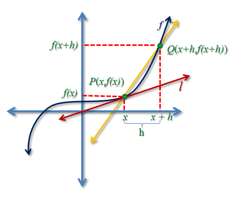
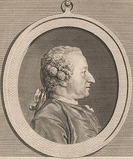
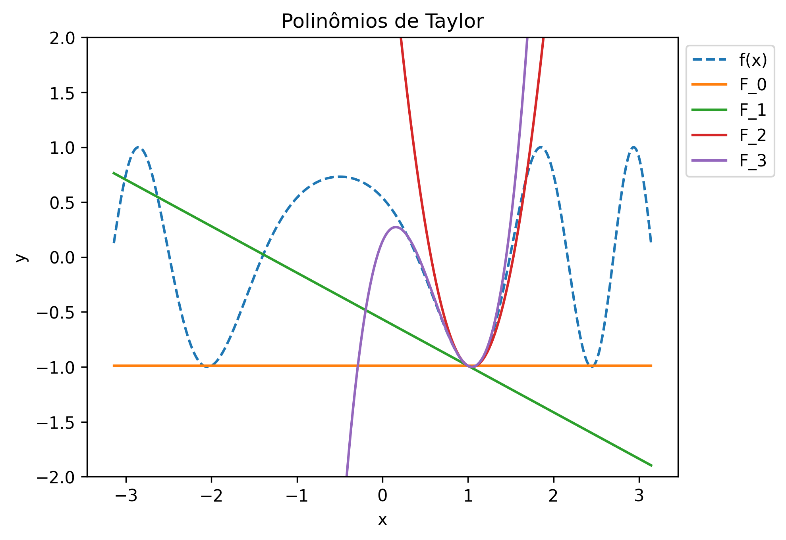
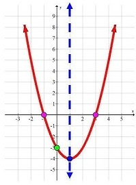

# CC0323: Elementos de Cálculo
Michael Souza

*michael@ufc.br*

---

## O que é uma derivada?

### Interpretações
1. Geométrica
2. Aproximativa
3. Variacional

---
### Norma de um vetor

A norma de um vetor $x = (x_1, x_2, \ldots, x_n)$ no espaço euclidiano $\mathbb{R}^n$ é dada por:

$$\|x\| = \sqrt{\sum_{i=1}^n x_i^2}$$

**Exemplo**:

Em  $\mathbb{R}^2$, para $x = (3, 4)$, temos $\|x\| = \sqrt{3^2 + 4^2} = 5$.

Em $\mathbb{R}$, a norma é dada por $\|x\| = |x|$ (módulo).

---

### Distância Norma-Induzida

Toda norma em $\mathbb{R}^n$ induz uma métrica, que é a distância entre dois pontos $x$ e $y$ dada por:

$$d(x, y) = \|x - y\|$$

**Exemplo**:

Em $\mathbb{R}^2$, a distância entre $x = (x_1, x_2)$ e $y = (y_1, y_2)$ é dada por:

$$d(x, y) = \sqrt{(x_1 - y_1)^2 + (x_2 - y_2)^2}$$

Para $x=(3, 4)$ e $y=(1, 3)$, temos $d(x, y) = \sqrt{(3-1)^2 + (4-3)^2} = \sqrt{5}$.

---
## Sequências e Limites

### Sequência de números reais	

Uma sequência de números reais é uma função $a: \mathbb{N} \to \mathbb{R}$, onde $n \in \mathbb{N}$ e $a(k) \in \mathbb{R}$.

**Exemplo**: 

A sequência gerada por $a(k) = 1/k$ é dada por $\{1, 1/2, 1/3, 1/4, \ldots\}.$

---
### Limite

Dizemos que a sequência $a(k)$ converge para o número real $L$ se, para todo $\epsilon > 0$, existe um número natural $k_0$ tal que $|a(k) - L| < \epsilon$ para todo $k \geq k_0$.

Escrevemos de modo abreviado:
$$\lim_{k \to \infty} a(k) = L\;\;\text{ou} \;\;a_k \to L$$

**Exemplo**:

A sequência $a_k = 1/k$ converge para $L = 0$.

---

### Teorema
Uma sequência convergente tem um único limite.

**Prova:** Por contradição, suponha que $a_k \to L$ e $a_k \to M$. Então, para $\epsilon = |L - M|/2$, existem $k_1$ e $k_2$ tais que $|a_k - L| < \epsilon$ e $|a_k - M| < \epsilon$ para $k \geq k_1$ e $k \geq k_2$, respectivamente.

Neste caso, para $k > \max\{k_1,k_2\}$, devemos ter 
$$\epsilon = \frac{|L-M|}{2} = \frac{|L - a_k + a_k - M|}{2} \leq \frac{|a_k - L| + |a_k - M|}{2} < \frac{\epsilon + \epsilon}{2} =\epsilon.$$

Mas isto é obviamente impossível.

---

### Teorema
Toda sequência convergente é limitada.

**Prova:** Se $a_k \to L$, então existe $k_0$ tal que $|a_k - L| < 1$ para $k \geq k_0$. Assim, para $k \geq k_0$, temos $|a_k| = |a_k - L + L| \leq |a_k - L| + |L| < 1 + |L|$. Portanto, $|a_k| < 1 + |L|$ para $k \geq k_0$.

Agora, tome $M = \max\{|a_1|, |a_2|, \ldots, |a_{k_0-1}|, 1 + |L|\}$. Então, $|a_k| \leq M$ para todo $k \in \mathbb{N}$ e, portanto, a sequência é limitada.

---
### Supremo

Seja $A \subset \mathbb{R}$ um conjunto não vazio e limitado superiormente. O número real $L$ é o **supremo** de $A$, denotado por $L = \sup\{A\}$, se:
1. $L$ é um limitante superior de $A$;
2. Para todo $\epsilon > 0$, existe $a \in A$ tal que $L - \epsilon < a \leq L$.

**Exemplo:** 

a. $\sup\{1 - 1/n\} = 1$

b. $\sup\{\cos(x)\} = 1$

  

---

De modo análogo, podemos definir o conceito de **ínfimo** de um conjunto $A \subset \mathbb{R}$.

### Ínfimo

Seja $A \subset \mathbb{R}$ um conjunto não vazio e limitado inferiormente. O número real $L$ é o **ínfimo** de $A$, denotado por $L = \inf\{A\}$, se:

1. $L$ é um limitante inferior de $A$;
2. Para todo $\epsilon > 0$, existe $a \in A$ tal que $L \leq a < L + \epsilon$.

**Exemplo:**

a. $\inf\{1 - 1/n\} = 0$

b. $\inf\{\cos(x)\} = -1$

---

### Teorema

Toda sequência monótona limitada em $\mathbb{R}$ é convergente.

**Prova:** Seja $a_k$ uma sequência monótona crescente e limitada. Então, existe $L = \sup\{a_k\}$. Dado $\epsilon > 0$, existe $k_0$ tal que $L - \epsilon < a_{k_0} \leq L$. Como $a_k$ é crescente, temos $L - \epsilon < a_k \leq L$ para $k \geq k_0$. Portanto, $a_k \to L$.

---

## Diferenciabilidade

O cálculo diferencial é baseado na ideia de aproximar uma função qualquer $f:\mathbb{R}^n\to\mathbb{R}^m$ por uma função afim $\mathcal{F}$.

### Função Afim

Uma função $\mathcal{F}: \mathbb{R}^n \to \mathbb{R}^m$ é afim se existe uma matriz $A \in \mathbb{R}^{m \times n}$ e um vetor $b \in \mathbb{R}^m$ tais que:

$$\mathcal{F}(x) = Ax + b, \;\;x \in \mathbb{R}^n$$

---

Desejamos encontrar a melhor aproximação afim $\mathcal{F}$ para $f$ em um ponto $x_0$.

Primeiro, impomos a condição natural de que $\mathcal{F}(x_0) = f(x_0)$ e obtemos 

$$\mathcal{F}(x_0) = Ax_0 + b = f(x_0) \Rightarrow b = f(x_0) - Ax_0$$

 

Pela linearidade de $A$, temos que 

$$\mathcal{F}(x) + b = Ax + f(x_0) - Ax_0 = A(x - x_0) + f(x_0)$$

Agora, exigimos que $\mathcal{F}(x)$ se aproxime de $f(x)$ mais rápido que $x$ se aproxima de $x_0$,
 

$$\lim_{x \to x_0} \frac{\|f(x) - \mathcal{F}(x) \|}{\|x - x_0\|} = 0$$

---

## Função Diferenciável

Uma função $f: \mathbb{R}^n \to \mathbb{R}^m$ é diferenciável em $x_0 \in \mathbb{R}^n$ se existe uma matriz $A \in \mathbb{R}^{m \times n}$ tal que:

$$\lim_{x \to x_0} \frac{\|f(x) - \mathcal{F}(x) \|}{\|x - x_0\|} = \lim_{x \to x_0} \frac{\|f(x) - (A(x - x_0) - f(x_0) ) \|}{\|x - x_0\|} = 0$$

Além disso, uma função é dita diferenciável em um conjunto $D \subset \mathbb{R}^n$ se é diferenciável em todo ponto de $D$.

---

Em uma função diferenciável $f:\mathbb{R}\to\mathbb{R}$, temos 

$$
\begin{align*}
0 &= \lim_{x \to x_0} \frac{|f(x) - (A(x - x_0) - f(x_0))|}{|x - x_0|} \\
&= \lim_{x \to x_0} \frac{|f(x) - f(x_0) - A(x - x_0)|}{|x - x_0|} \\
&= \lim_{x \to x_0} \left|\frac{f(x) - f(x_0)}{x - x_0} - A\frac{x - x_0}{x - x_0}\right|\\
&= \lim_{x \to x_0} \left|\frac{f(x) - f(x_0)}{x - x_0} - A\right|
\end{align*} \Rightarrow A = \lim_{x \to x_0} \frac{f(x) - f(x_0)}{x - x_0} = f'(x_0)
$$

---

**Exemplo**:
Em $\mathbb{R}$, se $\mathcal{F}(x) = ax + b$ aproxima $f(x)$ em $x_0$, então quando $x\to x_0$ temos

$$f(x) \approx A(x - x_0) + b = f'(x_0)(x-x_0) + f(x_0)$$

---

### Vetor Gradiente
Quando $f:\mathbb{R}^n \to \mathbb{R}$, a derivada de $f$ em $u \in \mathbb{R}^n$ é um vetor coluna chamado de **vetor gradiente** de $f$ em $u$ e é denotado por $\nabla f(u)$.

O vetor gradiente é dado por:

$$\nabla f(u) = \begin{bmatrix}
\frac{\partial f}{\partial x_1}(u) & \frac{\partial f}{\partial x_2}(u) & \cdots & \frac{\partial f}{\partial x_n}(u)
\end{bmatrix},$$

onde 

$$\frac{\partial f}{\partial x_i}(u) = \lim_{h \to 0} \frac{f(u + he_i) - f(u)}{h},$$

onde $e_i$ é o $i$-ésimo vetor da base canônica de $\mathbb{R}^n$ e $h \in \mathbb{R}$.

---
**Exemplo**:

a) Considere a função $f(x, y) = x^2 + y^2$. O vetor gradiente de $f$ é dado por:

$$\nabla f(x, y) = \begin{bmatrix}
\frac{\partial f}{\partial x}(x, y) & \frac{\partial f}{\partial y}(x, y)
\end{bmatrix} = \begin{bmatrix}2x & 2y
\end{bmatrix}$$

b) Considere a função $f(x, y) = x^2 + 2xy^3 + y^2$. O vetor gradiente de $f$ em $(3, 4)$ é dado por:

$$\nabla f(x, y) = 
\begin{bmatrix}
\frac{\partial f}{\partial x}(x, y) & \frac{\partial f}{\partial y}(3, 4)
\end{bmatrix} = 
\begin{bmatrix} 2x + 2y^3 & 6xy^2 + 2y
\end{bmatrix}$$

Agora, tomando $(x,y) = (3, 4)$, temos $\nabla f(3, 4) = \begin{bmatrix} 134 & 296 \end{bmatrix}.$

---

### Matriz Hessiana

Se $f: \mathbb{R}^n \to \mathbb{R}$ é diferenciável em $x_0$, então a matriz jacobiana de $\nabla f$ é chamada de **matriz hessiana** de $f$ em $x_0$ e é denotada por $\nabla^2 f(x_0)$.

A matriz hessiana é dada por:

$$\nabla^2 f(x_0) = \begin{bmatrix}
\frac{\partial^2 f}{\partial x_1^2}(x_0) & \frac{\partial^2 f}{\partial x_1 \partial x_2}(x_0) & \cdots & \frac{\partial^2 f}{\partial x_1 \partial x_n}(x_0)\\
\frac{\partial^2 f}{\partial x_2 \partial x_1}(x_0) & \frac{\partial^2 f}{\partial x_2^2}(x_0) & \cdots & \frac{\partial^2 f}{\partial x_2 \partial x_n}(x_0)\\
\vdots & \vdots & \ddots & \vdots\\
\frac{\partial^2 f}{\partial x_n \partial x_1}(x_0) & \frac{\partial^2 f}{\partial x_n \partial x_2}(x_0) & \cdots & \frac{\partial^2 f}{\partial x_n^2}(x_0)
\end{bmatrix}$$

---

**Exemplo**:

a) Considere a função $f(x, y) = x^2 + y^2$. A matriz hessiana de $f$ é dada por:

$$\nabla^2 f(x, y) = \begin{bmatrix}
\frac{\partial^2 f}{\partial x^2}(x, y) & \frac{\partial^2 f}{\partial x \partial y}(x, y)\\
\frac{\partial^2 f}{\partial y \partial x}(x, y) & \frac{\partial^2 f}{\partial y^2}(x, y)
\end{bmatrix} = \begin{bmatrix}
2 & 0\\
0 & 2
\end{bmatrix}$$

b) Considere a função $f(x, y) = x^3 + 3xy + 2y^3$. A matriz hessiana de $f$ é dada por:

$$\nabla^2 f(x, y) = \begin{bmatrix}
\frac{\partial^2 f}{\partial x^2}(x, y) & \frac{\partial^2 f}{\partial y \partial x}(x, y)\\
\frac{\partial^2 f}{\partial y \partial x}(x, y) & \frac{\partial^2 f}{\partial y^2}(x, y)
\end{bmatrix} = \begin{bmatrix}
6x & 3\\
3 & 12y
\end{bmatrix}$$

Em $(x,y)=(1,2)$ temos $\nabla^2 f(1, 2) = \begin{bmatrix} 6 & 3\\ 3 & 24 \end{bmatrix}$.

---

  

### Teorema de Clairaut
Se $f: \mathbb{R}^n \to \mathbb{R}$ é diferenciável em $u$, então 
$$\frac{\partial^2 f}{\partial x_i \partial x_j}(u) = \frac{\partial^2 f}{\partial x_j \partial x_i}(u)$$ 
para todo $i, j = 1, 2, \ldots, n$.

 

Ou seja, a matriz hessiana de $f$ de uma função diferenciável é ***simétrica***.

  
  
Alexis Claude Clairaut  (1713-1765)

---

Vimos que a aproximação afim de $f:\mathbb{R}^n \to \mathbb{R}^m$ em $u \in \mathbb{R}^n$ é dada por:

$$F(x) \approx f'(u)(x - u) + f(u)$$

Esta aproximação tem as seguintes propriedades:

1. $F(u) = f(u)$;
2. $F'(u) = \frac{\partial F}{\partial x}(u) = f'(u)$;

 

***O que obtemos se impusermos $F''(u) = f''(u)$?***

Como $F''(u)$ é afim (polinômio do 1º grau), teremos $F''(u) = 0$. :worried:

 

Mas e se ***aumetarmos o grau*** de $F$? :thinking:

---

Vamos supor que $F(x) = ax^2+bx+c$ é um polinômio de grau 2 e impor que, para $u \in \mathbb{R}$ fixado, temos:
1. $F(u) = f(u)$;
2. $F'(u) = \frac{\partial F}{\partial x}(u) = f'(u)$;
3. $F''(u) = \frac{\partial^2 F}{\partial x^2}(u) = f''(u)$;

Quais são as variáveis deste sistema?
Estes sistema é linear ou não-linear?
Temos quantas equações e quantas variáveis?
Este sistema é determinado ou indeterminado?

---

A solução deste sistema é dada por

$$F(x) = f(u) + f'(u)(x - u) + \frac{1}{2}f''(u)(x - u)^2$$

Verifique se esta afirmação é verdadeira. :thinking:

---

De modo geral, o sistema dado por

$$\left\{\begin{align*}
F(u) &= f(u)\\
F'(u) &= f'(u)\\
\ldots\\
F^{(k)}(u) &= f^{(k)}(u)
\end{align*}\right.$$
com $F(x)=a_0+a_1x+a_kx^k$ sempre terá solução dada por um  ***Polinômio de Taylor***.

### Polinômio de Taylor

O polinômio de Taylor de ordem $k$ de uma função $f:\mathbb{R} \to \mathbb{R}$ em $u \in \mathbb{R}$ é dado por:

$$F_k(x) = f(u) + f'(u)(x - u) + \frac{1}{2!}f''(u)(x - u)^2 + \cdots + \frac{1}{k!}f^{(k)}(u)(x - u)^k$$

---

---

Podemos definir o polinômio de Taylor para funções de várias variáveis. 

Nesta disciplina de otimização, estaremos interessados em funções $f:\mathbb{R}^n \to \mathbb{R}$ e aproximações de ordem 2. 

Por quê? :thinking:

### Polinômio de Taylor de ordem 2

O polinômio de Taylor de ordem 2 de uma função $f:\mathbb{R}^n \to \mathbb{R}$ em $u \in \mathbb{R}^n$ é dado por:

$$F(x) = f(u) + \nabla f(u)(x - u) + \frac{1}{2}(x - u)^T\nabla^2 f(u)(x - u)$$

---

**Exemplos:**

a) Considerando a função $f(x, y) = 3x^5 + 2xy + y^2$, calcule o polinômio de Taylor de ordem 2 de $f$ em $(1, 2)$.

---

# Perguntas?
