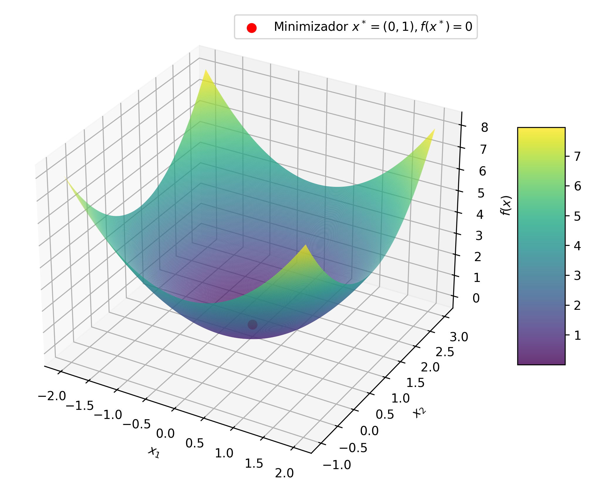

# CC0323: Otimização Irrestrita
Michael Souza

*michael@ufc.br*

---

### Problema de Otimização Não-Linear

Dado um conjunto $\Omega \subset \mathbb{R}^n$ e uma função $f: \Omega \to \mathbb{R}$, o problema de otimização não-linear consiste em encontrar um ponto $x^* \in \Omega$ que minimize (ou maximize) a função $f$. Ou seja, desejamos encontrar

$$x^* = \arg\min_{x \in \Omega} f(x).$$

### Mínimo vs Minimizador

O ponto $x^*$ é chamado de ***minimizador*** (ou ***maximizador***) de $f$ em $\Omega$, enquanto o valor $f(x^*)$ é chamado de ***mínimo*** (ou ***máximo***) de $f$ em $\Omega$.

---

**Exemplo**:

1. Considere a função $f(x) = x_1^2 + (x_2-1)^2$ e o conjunto $\Omega = \mathbb{R}$. O ponto $x^* = (0, 1)$ é o minimizador de $f$ em $\Omega$, enquanto o valor $f(x^*) = 1$ é o mínimo de $f$ em $\Omega$.

  

---

### Curva de Nível

A curva de nível de uma função $f:\mathbb{R}^n \to \mathbb{R}$ é o conjunto de pontos $(x_1, x_2, \ldots, x_n)$ onde $f(x) = c$ para algum $c \in \mathbb{R}$.

***Exemplo**:

Considere a função $f(x_1, x_2) = x_1^2 + (x_2-1)^2$. A curva de nível de $f$ para $c = 1$ é dada por $x_1^2 + (x_2-1)^2 = 1$, que é o círculo de raio 1 centrado em $(0, 1)$.

---

2. Considere a função $f(x) = (x-1)^2 - 2$ e o conjunto $\Omega = \{x \in \mathbb{R} \mid -1 \leq x \leq 0\}$. O ponto $x^* = 1$ é o minimizador de $f$ em $\Omega$, enquanto o valor $f(x^*) = 2$ é o mínimo de $f$ em $\Omega$.

  
  

---

### Problema de Otimização Irrestrita

Quando o conjunto $\Omega$ é todo o espaço $\mathbb{R}^n$, dizemos que o problema de otimização é ***irrestrito*** (sem restrições).

### Ideia Básica

Dado um ponto inicial $x_0$, a ideia é gerar uma sequência de pontos $\{x_k\}$ tal que $f(x_k) \to f(x^*)$.

Em cada ponto teremos uma direção $d_k$ e um passo $\alpha_k$ que nos levará a um novo ponto $x_{k+1}$.
$$x_k = x_{k-1} + \alpha_k d_k \;\;\text{ e }\;\; f(x_k) < f(x_{k-1})$$

---

### Otimização Unidimensional

---

# Perguntas?
