# CC0323: Otimização Irrestrita
Michael Souza

*michael@ufc.br*

---

### Problema de Otimização Não-Linear

Dado um conjunto $\Omega \subset \mathbb{R}^n$ e uma função $f: \Omega \to \mathbb{R}$, o problema de otimização não-linear consiste em encontrar um ponto $x^* \in \Omega$ que minimize (ou maximize) a função $f$. Ou seja, desejamos encontrar

$$x^* = \arg\min_{x \in \Omega} f(x).$$

### Mínimo vs Minimizador

O ponto $x^*$ é chamado de ***minimizador*** (ou ***maximizador***) de $f$ em $\Omega$, enquanto o valor $f(x^*)$ é chamado de ***mínimo*** (ou ***máximo***) de $f$ em $\Omega$.

---

**Exemplo**:

1. Considere a função $f(x) = (x-1)^2 - 2$ e o conjunto $\Omega = \mathbb{R}$. O ponto $x^* = 1$ é o minimizador de $f$ em $\Omega$, enquanto o valor $f(x^*) = f(1) = -2$ é o mínimo de $f$ em $\Omega$.

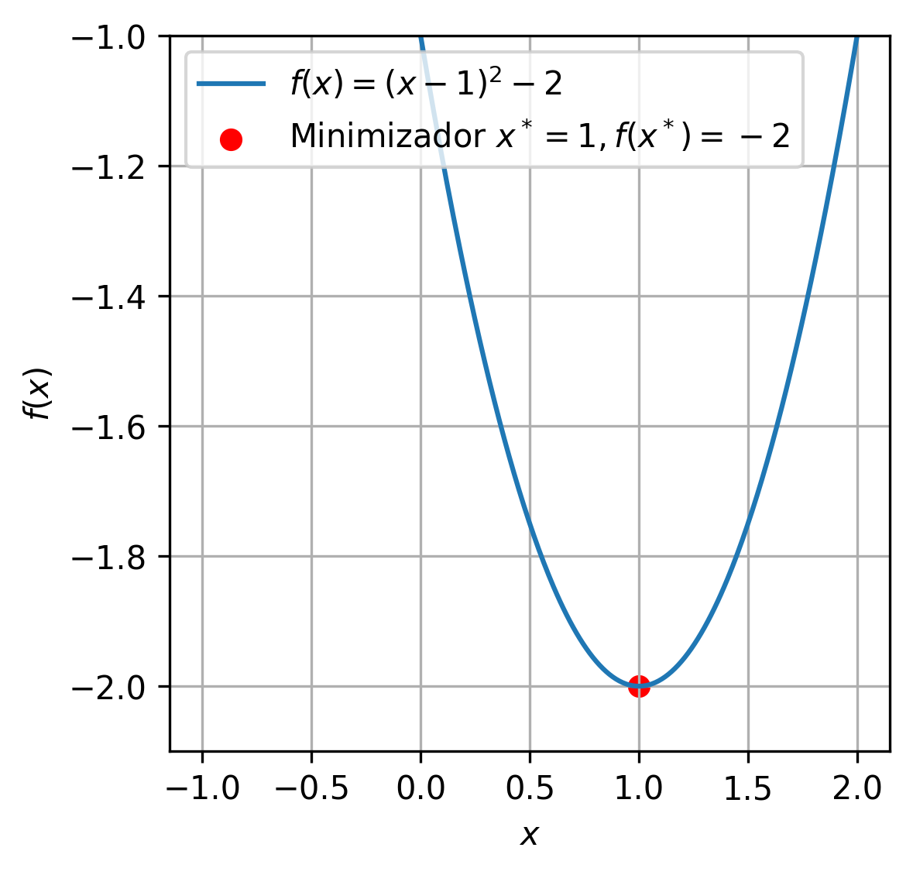

---

2. Considere a mesma função do exemplo anterior, mas $\Omega [-1,0]$. 
Neste caso, $x=1$ ***não é viável*** (não pertence a $\Omega$) e o mimizador $x^*$ passa a ser 0 e o mínimo será $f(x^*)=f(0)=-1$.

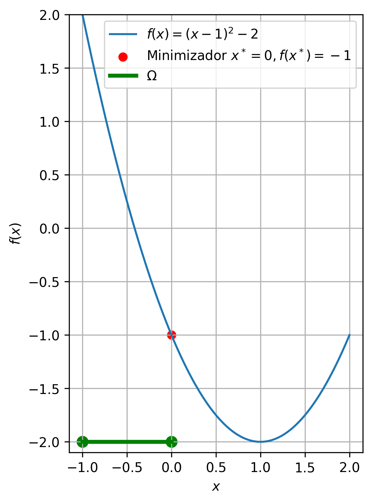

 

**Observação:** 
O minimizador depende tanto da função $f$ quanto do conjunto viável $\Omega$. 

---

3. Agora, considere a função $f(x_1,x_2) = x_1^2 + (x_2 - 1)^2$. Como $f$ é uma soma de quadrados, temos que $f(x) \geq 0$ para todo $x \in \mathbb{R}^2.$ 
Portanto, o minizador de $f$ em $\mathbb{R}^2$ é $x^* = (0, 1)$, pois $f(x^*) = 0.$ 

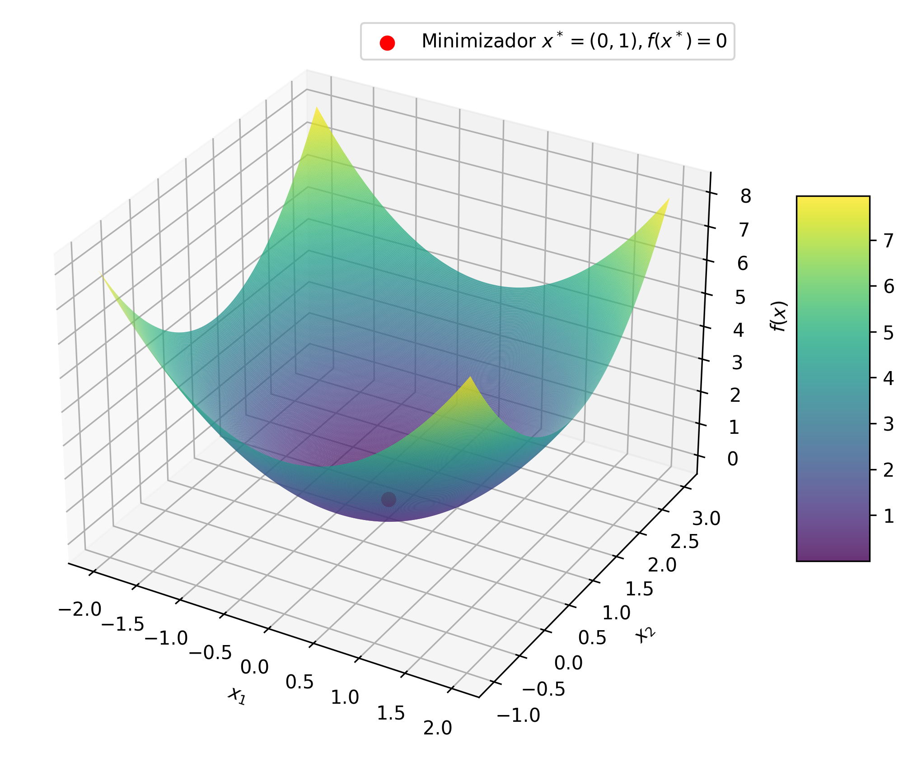

---

### Curva de Nível

A curva de nível de uma função $f:\mathbb{R}^n \to \mathbb{R}$ é o conjunto de pontos $(x_1, x_2, \ldots, x_n)$ onde $f(x) = c$ para algum $c \in \mathbb{R}$.

**Observações:**
As curvas de nível são úteis para visualizar funções de duas variáveis, cujos gráficos são pontos $(x_1,x_2,f(x_1,x_2))\in\mathbb{R}^3.$

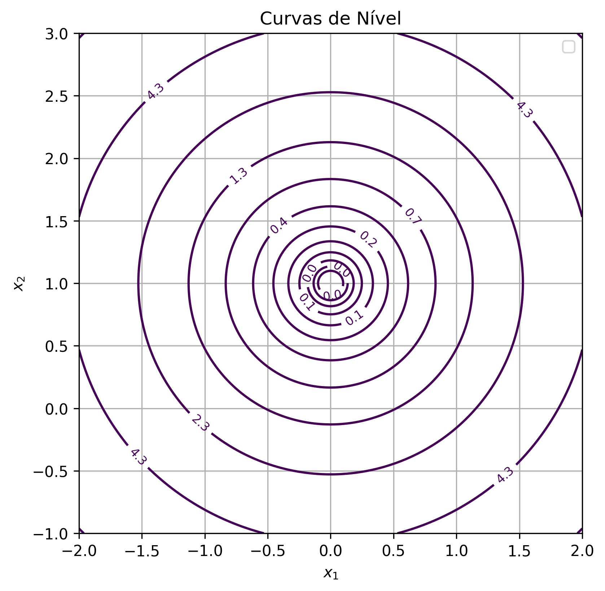

--- 

**Exemplo**:

Para a função $f(x_1, x_2) = x_1^2 + (x_2-1)^2$, uma curva de nível $c$ é o conjunto solução da equação $f(x) = x_1^2 + (x_2-1)^2 = c$, ou seja, é o círculo de raio $\sqrt{c}$ centrado em $(0, 1)$.

  
  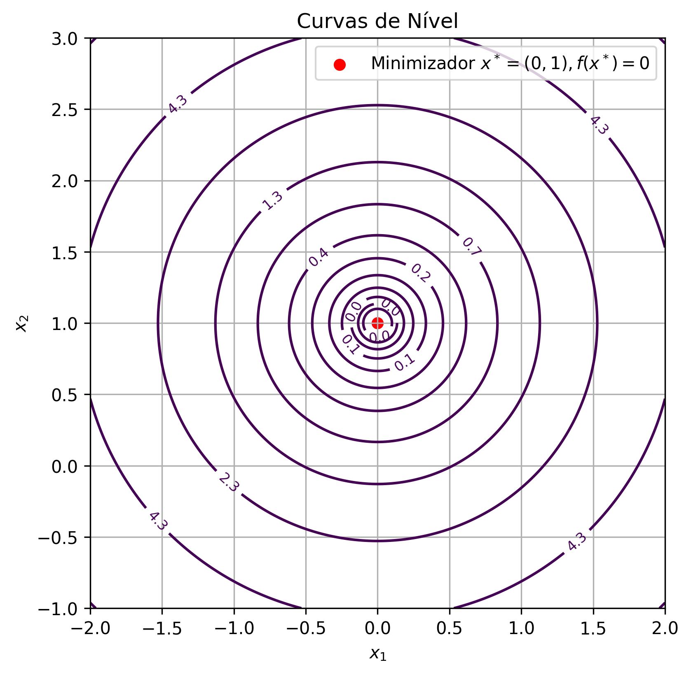

---

### Problema de Otimização Irrestrita

Quando o conjunto $\Omega$ é todo o espaço $\mathbb{R}^n$, dizemos que o problema de otimização é ***irrestrito*** (sem restrições).

### Ideia Básica

Dado um ponto inicial $x_0$, a ideia é gerar uma sequência de pontos $\{x_k\}$ tal que $f(x_k) \to f(x^*)$.

Em cada ponto teremos uma direção $d_k$ e um passo $\alpha_k$ que nos levará a um novo ponto $x_{k+1}$.
$$x_k = x_{k-1} + \alpha_k d_k \;\;\text{ e }\;\; f(x_k) < f(x_{k-1})$$

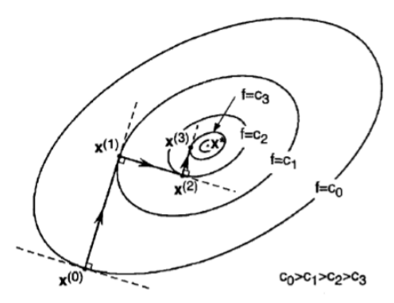

---

### Otimização Unidimensional

Em cada passo do método geral, precisamos resolver um problema de otimização unidimensional. Ou seja, dado um ponto $x_k$ e uma direção $d_k$, precisamos encontrar um passo (minimizador)

$$\alpha_k = \arg\min_{\alpha} \phi_k(\alpha) = \arg\min_{\alpha} f(x_k + \alpha d_k).$$

Portanto, precisamos de um método para resolver problemas de otimização unidimensional.

---
#### Método da Seção Áurea

O método da seção áurea serve para encontrar o mínimo de uma função unimodal em um intervalo $[a_0, b_0] \subset \mathbb{R}$.

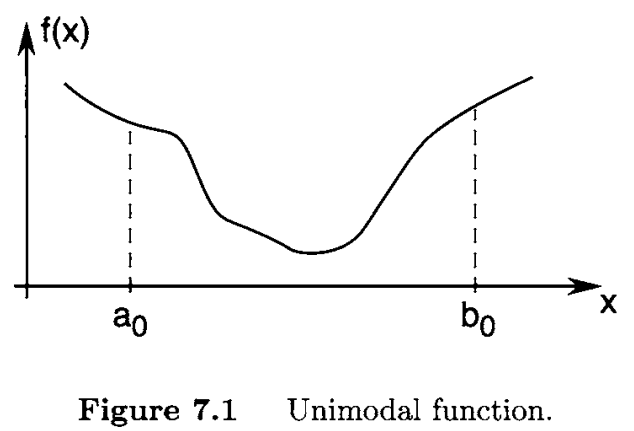

---

**Algoritmo**

1. Escolhemos $a_1$ e $b_1$ tais que $a_0 < a_1 < b_1 < b_0$ e 

$$b_1 - a_1 = \rho (b_0 - a_0),$$

onde $\rho = \frac{3 - \sqrt{5}}{2} \approx 0.382$.

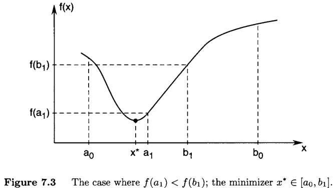

---

2. Calculamos 
$f(a_1)$ e $f(b_1)$.

---

3. Se $f(a_1) < f(b_1)$, então o mínimo está no intervalo $[a_0, b_1]$. 
Caso contrário, o mínimo está no intervalo $[a_1, b_0]$.

---

4. Agora, repetimos o processo até que o intervalo seja suficientemente pequeno.

---

O valor $\rho=0.382$ decorre de duas ideias simples:

- Simetria, pois não temos razão para preferirmos um dos lados.
$$\frac{b_0 - b_1}{b_0 - a_0} = \frac{a_1 - a_0}{b_0 - a_0} = \rho < \frac{1}{2}$$

- Reuso, queremos reduzir o número de avaliações de $f$.

$$\rho(b_1 - a_0) = b_1 - b_2$$

  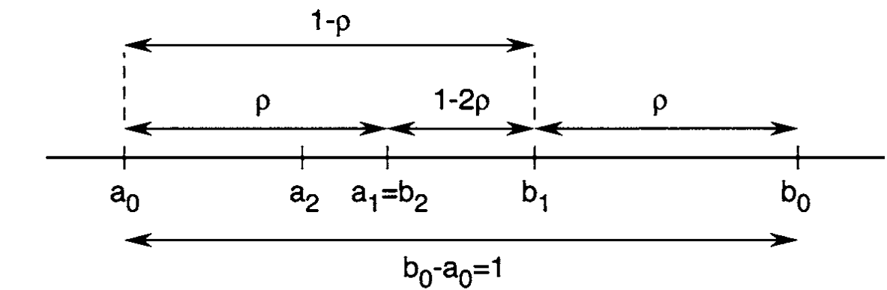

---
A cada passo, o intervalo de incerteza é reduzido por um fator 
$$(1-\rho)\approx=0.61803$$

 

Então, após $N$ passos o intervalo original será reduzido por um fator 

$$(1-\rho)^N=(0.61803)^N$$

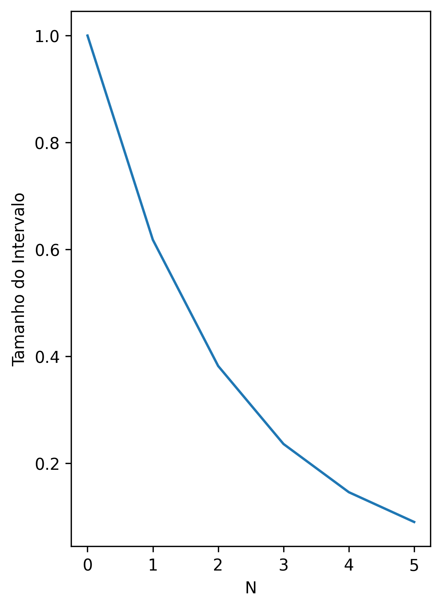

---

**Exemplo**

Suponha que queremos utilizar a seção áurea para encontrar o mínimo da função $f(x) = x^4 - 14x^3 + 60x^2 - 70x$ no intervalo $[0, 2]$. Desejamos uma precisão de $10^{-3}$, ou seja, $|b_k - a_k| < 10^{-3}$.

---

### Método de Newton

Quando a função $f$ é duas vezes diferenciável, podemos utilizar o método de Newton para encontrar seu mínimo.

A ideia é aproximar a função $f$ por uma função quadrática $q$ e encontrar o mínimo da aproximação.

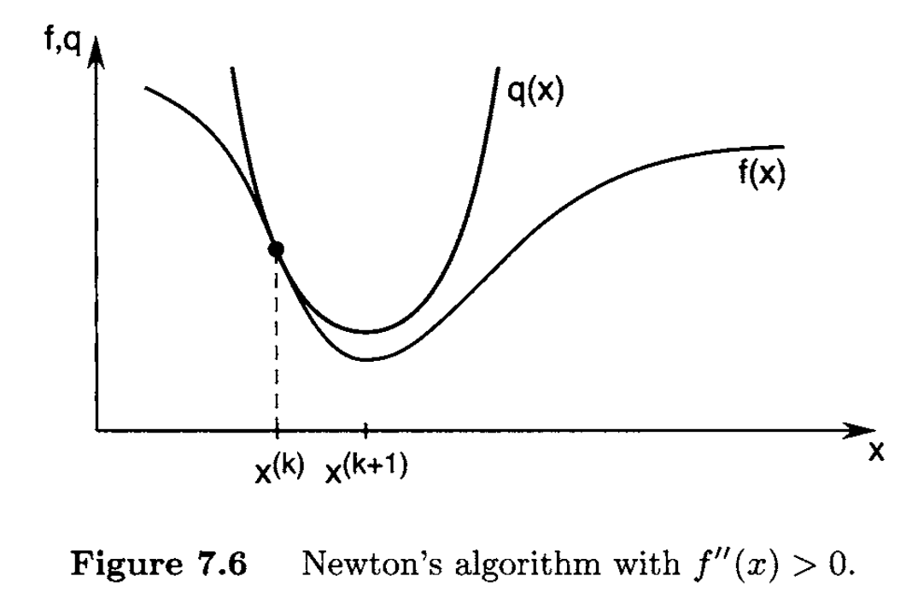

---

A aproximação quadrática $q$ é dada pelo polinômio de Taylor de segunda ordem de $f$ em torno de $x_k$.

$$q(x) = f(x_k) + f'(x_k)(x - x_k) + \frac{1}{2}f''(x_k)(x - x_k)^2.$$

Cujo mínimo (vértice) é dado por

$$x_{k+1} = x_k - \frac{f'(x_k)}{f''(x_k)}.$$

---

# Perguntas?
