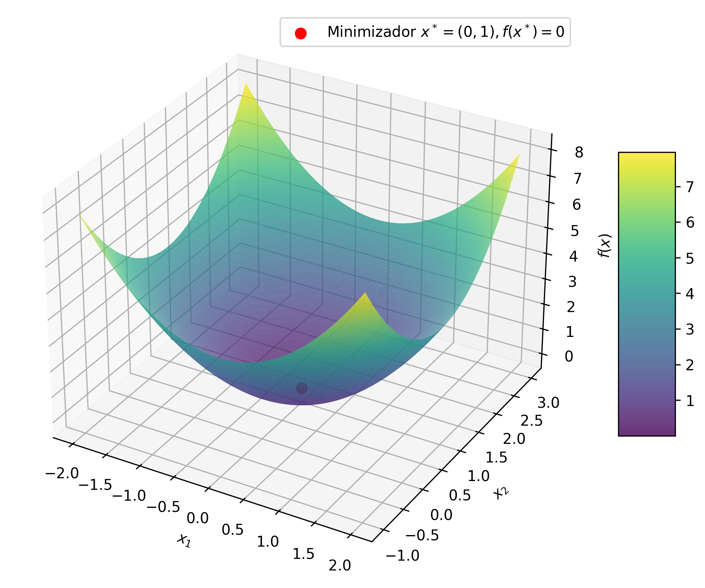
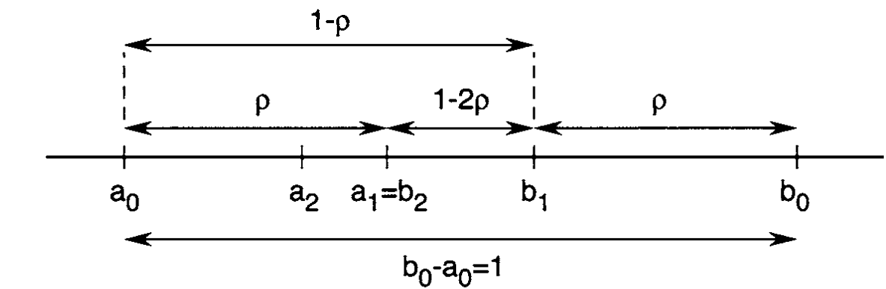

# CC0323: Conceitos Básicos de Otimização
Michael Souza

*michael@ufc.br*

---

### Problema de Otimização Não-Linear

Dado um conjunto $\Omega \subset \mathbb{R}^n$ e uma função $f: \Omega \to \mathbb{R}$, o problema de otimização não-linear consiste em encontrar um ponto $x^* \in \Omega$ que minimize (ou maximize) a função $f$. Ou seja, desejamos encontrar

$$x^* = \arg\min_{x \in \Omega} f(x).$$

A função $f$ é chamada de **função custo** ou **função objetivo**. O vetor $x=(x_1, x_2, \ldots, x_n)\in\mathbb{R}^n$  é formado por $n$ variáveis independentes que são chamadas de *variáveis de decisão*. Finalmente, o conjunto $\Omega$ é chamado de **conjunto restrição** ou **conjunto viável**.

---

### Mínimo vs Minimizador

Um vetor $x^ast \in \Omega$, onde a $f$ atinge seu menor valor é chamado de ***minimizador*** (ou ***maximizador***) de $f$ em $\Omega$, enquanto o valor $f(x^ast)$ é chamado de ***mínimo*** (ou ***máximo***) de $f$ em $\Omega$.

Em alguns problemas, o objetivo é encontrar o **maximizador** em vez do minizador. De modo geral, chamamos os maximizadores e minimizadores de **pontos extremos**.

### Problema Restrito vs Problema Irrestrito
Quando $\Omega = \mathbb{R}^n$, dizemos que problema de otimização é **irrestrito**, ou seja, as variáveis de decisão podem assumir qualquer valor. Por outro lado, quando $\Omega \subsetneq \mathbb{R}^n$, dizemos que o problema de otimização é **restrito**, ou seja, existem vetores $x\in\mathbb{R}^n$ que não fazem parte de $\Omega$ e, portanto, não devem ser considerados na busca por soluções.

---

### Restrições
A restrição $x\in\Omega$ é chamada de **restrição de conjunto**. Mais frequentemente, esta restrição toma a forma
$$x \in \Omega =\{x:h(x) = 0,\; g(x)\leq 0\},$$
onde $h:\mathbb{R}^n\to\mathbb{R}^m$ e $g:\mathbb{R}^n\to\mathbb{R}^p$ são funções definidas **a priori**. Quando apresentadas desta forma, temos **restrições funcionais**.

---

### Minimizador Local vs Minimizador Global
Um ponto $x^\ast \in \Omega$ é um **minizador local** de $f$ em $\Omega$ se existe $\epsilon > 0$ tal que $f(x) \geq f(x^\ast)$ para todo $x\in\Omega$ e $||x - x^\ast|| < \epsilon$. Por outro lado, $x^\ast$ é um **minimizador global** de $f$ em $\Omega$ se $f(x) \geq f(x^\ast)$ para todo $x\in\Omega$.

Se nestas definições acima pudermos substituir $\geq$ por $>$, então teremos um **minimizador local estrito** ou um **minimizador global estrito**.

Caso exista, um minimizador global estrito, então ele é único.

---

### Exemplo

---

*Observações:*

- Caso exista um minimizador global estrito, então ele será único. Os minimizadores locais não tem essa propriedade. 

- De modo formal (lógico), um problema de otimização é resolvido apenas quando encontramos um minimizador global. No entanto, na prática, é muito difícil encontrar um minimizador global, então nos contentamos com minimizadores locais.

---

### Direção Viável

Dado um ponto $x\in\Omega$, uma direção $d\in\mathbb{R}^n$ é chamada de **direção viável** se existe $\alpha > 0$ tal que $x + \alpha d \in \Omega$.

---

### Derivada Direcional

A **derivada direcional** de $f$ em $x$ na direção $d$ é dada por

$$f'(x;d) = \frac{\partial f}{\partial d}(x) = \lim_{\alpha\to 0} \frac{f(x + \alpha d) - f(x)}{\alpha}.$$

Quando a norma do vetor direção é unitária, ou seja,  

---

**Exemplo**:

1. Considere a função $f(x) = (x-1)^2 - 2$ e o conjunto $\Omega = \mathbb{R}$. O ponto $x^* = 1$ é o minimizador de $f$ em $\Omega$, enquanto o valor $f(x^*) = f(1) = -2$ é o mínimo de $f$ em $\Omega$.

---

2. Considere a mesma função do exemplo anterior, mas $\Omega [-1,0]$.
Neste caso, $x=1$ ***não é viável*** (não pertence a $\Omega$) e o mimizador $x^*$ passa a ser 0 e o mínimo será $f(x^*)=f(0)=-1$.

 

**Observação:**
O minimizador depende tanto da função $f$ quanto do conjunto viável $\Omega$.

---

3. Agora, considere a função $f(x_1,x_2) = x_1^2 + (x_2 - 1)^2$. Como $f$ é uma soma de quadrados, temos que $f(x) \geq 0$ para todo $x \in \mathbb{R}^2.$
Portanto, o minizador de $f$ em $\mathbb{R}^2$ é $x^* = (0, 1)$, pois $f(x^*) = 0.$

---

### Curva de Nível

A curva de nível de uma função $f:\mathbb{R}^n \to \mathbb{R}$ é o conjunto de pontos $(x_1, x_2, \ldots, x_n)$ onde $f(x) = c$ para algum $c \in \mathbb{R}$.

**Observações:**
As curvas de nível são úteis para visualizar funções de duas variáveis, cujos gráficos são pontos $(x_1,x_2,f(x_1,x_2))\in\mathbb{R}^3.$

---

**Exemplo**:

Para a função $f(x_1, x_2) = x_1^2 + (x_2-1)^2$, uma curva de nível $c$ é o conjunto solução da equação $f(x) = x_1^2 + (x_2-1)^2 = c$, ou seja, é o círculo de raio $\sqrt{c}$ centrado em $(0, 1)$.

  
  

---

### Problema de Otimização Irrestrita

Quando o conjunto $\Omega$ é todo o espaço $\mathbb{R}^n$, dizemos que o problema de otimização é ***irrestrito*** (sem restrições).

### Ideia Básica

Dado um ponto inicial $x_0$, a ideia é gerar uma sequência de pontos $\{x_k\}$ tal que $f(x_k) \to f(x^*)$.

Em cada ponto teremos uma direção $d_k$ e um passo $\alpha_k$ que nos levará a um novo ponto $x_{k+1}$.
$$x_k = x_{k-1} + \alpha_k d_k \;\;\text{ e }\;\; f(x_k) < f(x_{k-1})$$

---

### Otimização Unidimensional

Em cada passo do método geral, precisamos resolver um problema de otimização unidimensional. Ou seja, dado um ponto $x_k$ e uma direção $d_k$, precisamos encontrar um passo (minimizador)

$$\alpha_k = \arg\min_{\alpha} \phi_k(\alpha) = \arg\min_{\alpha} f(x_k + \alpha d_k).$$

Portanto, precisamos de um método para resolver problemas de otimização unidimensional.

---
#### Método da Seção Áurea

O método da seção áurea serve para encontrar o mínimo de uma função unimodal em um intervalo $[a_0, b_0] \subset \mathbb{R}$.

---

**Algoritmo**

1. Escolhemos $a_1$ e $b_1$ tais que

$$a_0 < a_1 < b_1 < b_0,$$

$$b_1 - a_1 = \rho (b_0 - a_0),$$

onde $\rho = \frac{3 - \sqrt{5}}{2} \approx 0.382$.

---

2. Calculamos
$f(a_1)$ e $f(b_1)$.

---

3. Se $f(a_1) < f(b_1)$, então o mínimo está no intervalo $[a_0, b_1]$.
Caso contrário, o mínimo está no intervalo $[a_1, b_0]$.

---

4. Agora, repetimos o processo até que o intervalo seja suficientemente pequeno.

---

O valor $\rho=0.382$ decorre de duas ideias simples:

- Simetria, pois não temos razão para preferirmos um dos lados.
$$\frac{b_0 - b_1}{b_0 - a_0} = \frac{a_1 - a_0}{b_0 - a_0} = \rho < \frac{1}{2}$$

- Reuso, queremos reduzir o número de avaliações de $f$.

$$\frac{b_1 - b_2}{b_1 - a_0} = \rho$$

  

---
A cada passo, o intervalo de incerteza é reduzido por um fator
$$(1-\rho)\approx0.61803$$

 

Então, após $N$ passos o intervalo original será reduzido por um fator

$$(1-\rho)^N=(0.61803)^N$$

 

E, como consequência, os erros $\epsilon_k = x_k - x^*$ satisfazem a relação

$$\epsilon_{k+1} = (1-\rho)\epsilon_k.$$

---

**Exemplo**

Suponha que queremos utilizar a seção áurea para encontrar o mínimo da função $f(x) = x^4 - 14x^3 + 60x^2 - 70x$ no intervalo $[0, 2]$. Desejamos uma precisão de $10^{-3},$ ou seja, $|b_k - a_k| < 10^{-3}$.

---

### Método de Newton

Quando a função $f$ é duas vezes diferenciável, podemos utilizar o método de Newton para encontrar seu mínimo.

A ideia é aproximar a função $f$ por uma função quadrática $q$ e encontrar o mínimo da aproximação.

---

A aproximação quadrática $q$ é dada pelo polinômio de Taylor de segunda ordem de $f$ em torno de $x_k$.

$$q(x) = f(x_k) + f'(x_k)(x - x_k) + \frac{1}{2}f''(x_k)(x - x_k)^2.$$

Cujo mínimo (vértice) é dado por

$$x_{k+1} = x_k - \frac{f'(x_k)}{f''(x_k)}.$$

---

### Taxa de Convergência do Método de Newton

Se $f$ é duas vezes diferenciável, $x^*$ é um mínimo de $f$, $f''(x^\ast) > 0$ e as demais derivadas são limitadas, então o método de Newton converge para $x^*$ com taxa quadrática, ou seja,

$$\epsilon_{k+1} \leq C \epsilon_k^2,$$

onde $\epsilon_k = |x_k - x^*|$ e $C$ é uma constante positiva.

**Prova**

Uma vez que $x_{k+1} = x_k - \frac{f'(x_k)}{f''(x_k)}$, então

$$x_{k+1} - x^* = x_k - x^* - \frac{f'(x_k)}{f''(x_k)} \longrightarrow \epsilon_{k+1} = \epsilon_k - \frac{f'(x_k)}{f''(x_k)}.$$

---
Agora, tomando a expansão em série de Taylor de $f'$ e $f''$ em torno de $x^*$, temos

$$\begin{align*}
f'(x_k) &= f'(x^*) + f''(x^*)(x_k - x^*) + \frac{1}{2}f'''(x^*)(x_k - x^*)^2 +\ldots\\
&= f'(x^*) + f''(x^*)\epsilon_k + \frac{1}{2}f'''(x^*)\epsilon_k^2 +\ldots
\end{align*}$$

Uma vez que $x^*$ é um mínimo, temos que $f'(x^*) = 0$ e $f''(x^*) > 0$. Portanto, podemos escrever

$$f'(x_k) = f''(x^*)\epsilon_k + \frac{1}{2}f'''(x^*)\epsilon_k^2 +\ldots.$$

---
Por outro lado, podemos escrever a expansão em série de Taylor de $f''$ em torno de $x^*$ como

$$\begin{align*}
f''(x_k) &= f''(x^*) + f'''(x^*)(x_k - x^*) + \frac{1}{2}f''''(x^*)(x_k - x^*)^2 +\ldots\\
&= f''(x^*) + f'''(x^*)\epsilon_k + \frac{1}{2}f''''(x^*)\epsilon_k^2 +\ldots
\end{align*}$$

E, colocando $f''(x^*)$ em evidência, temos

$$f''(x_k) = f''(x^*)\left(1 + \frac{f'''(x^*)}{f''(x^*)}\epsilon_k +\ldots\right).$$

---

Combinando as duas equações, temos

$$\begin{align*}
\epsilon_{k+1} &= \epsilon_k - \frac{\left(f''(x^*)\epsilon_k + \frac{1}{2}f'''(x^*)\epsilon_k^2 +\ldots\right)}{f''(x^*)} \times \left(1 + \frac{f'''(x^*)}{f''(x^*)}\epsilon_k +\ldots\right)^{-1}\\
&= \epsilon_k - \left(\epsilon_k + \frac{1}{2}\frac{f'''(x^*)}{f''(x^*)}\epsilon_k^2 +\ldots\right) \times \left(1 + \frac{f'''(x^*)}{f''(x^*)}\epsilon_k +\ldots\right)^{-1}\\
\end{align*}$$

 

Como $\epsilon_k \to 0$, devemos nos ater apenas aos termos de maior ordem. Mais especificamente, vamos mostrar que o termo $\epsilon_k$ do lado direito da equação acima é cancelado e, como consequência, o termo $\epsilon_k^2$ domina a convergência.

---

Agora, para $0 < x < 1$, temos $(1 + x)^{-1} = 1 - x + x^2 - x^3 + \ldots$,  e, uma vez que as derivadas de $f$ em $x^\ast$ são limitadas, então podemos substituir a inversa, obtendo

$$\begin{align*}
\epsilon_{k+1} &= \epsilon_k - \left(\epsilon_k + \frac{1}{2}\frac{f'''(x^*)}{f''(x^*)}\epsilon_k^2 +\ldots\right) \times \left(1 - \frac{f'''(x^*)}{f''(x^*)}\epsilon_k +\ldots\right).\\
&= \epsilon_k - \epsilon_k + \frac{1}{2}\frac{f'''(x^*)}{f''(x^*)}\epsilon_k^2 + O(\epsilon_k^3) \\
&= C \epsilon_k^2 + O(\epsilon_k^3)\\
&\approx C \epsilon_k^2.
\end{align*}$$

**Observação**
Isto significa que cada passo do método de Newton **dobra o número de dígitos corretos do minimizador.***

---

### Limitações do método de Newton

- O método de Newton é sensível à escolha do ponto inicial.

---

### Limitações do método de Newton

- O método de Newton é sensível à escolha do ponto inicial.

- O método de Newton pode ciclar ou divergir.

Na imagem ao lado, $g(x) = f'(x)$.

---

## Método da Secante

O método da secante é uma aproximação do método de Newton para funções unidimensionais.

A ideia é aproximar

$$f''(x_k) \approx \frac{f'(x_k) - f'(x_{k-1})}{x_k - x_{k-1}}.$$

Assim, a iteração de Newton se torna

$$\begin{align*}
x_{k+1} &= x_k - \frac{f'(x_k)(x_k - x_{k-1})}{f'(x_k) - f'(x_{k-1})} \\
&= \frac{f'(x_{k})x_{k-1} - f'(x_{k-1})x_k}{f'(x_{k}) - f'(x_{k-1})}.
\end{align*}$$

---

### Newton vs Secante

  
  

---

### Newton vs Secante

O método de Newton e da Secante são ajustes quadráticos.

- No método de Newton, a aproximação quadrática ajusta $f$, $f'$ e $f''$ em $x_k$.

- No método da Secante, a aproximação quadrática ajusta $f$ em $x_k$ e $f'$ em $x_k$ e $x_{k-1}$.

<!--
footer: S. D. Conte and C. de Boor, Elementary Numerical Analysis: An Algorithmic Approach, 3rd ed. New York: McGraw-Hill Book Co., 1980.
-->

---

## Otimização Inexata

No algoritmo geral, a otimização unidimensional é utilizada para encontrar o passo $\alpha_k$ que minimiza a função $f$ ao longo da direção $d_k$.

$$\alpha_k = \arg\min_{\alpha} \phi_k(\alpha),$$

onde $\phi_k(\alpha) = f(x_k + \alpha d_k).$

Na prática, a solução exata de cada problema unidimensional é custosa e desnecessária, portanto, podemos utilizar métodos aproximados.

---

### Regra de Armijo

A regra de Armijo é um critério de parada, onde

- um passo relativamente menor não reduz significativamente o valor da função.

$$\phi_k(\alpha_k) \leq \phi_k(0) + \epsilon \alpha_k \phi_k'(0),$$

- um passo relativamente maior não reduz significativamente o valor da função.

$$\phi_k(\gamma \alpha_k) \geq \phi_k(0) + \gamma \epsilon \alpha_k \phi_k'(0),$$

onde $\epsilon \in (0, 1)$ e $\gamma > 1$ são constantes.

---

# Perguntas?
