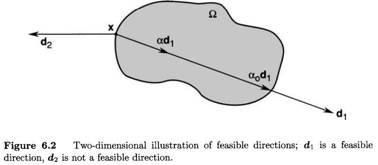

# CC0323: Conceitos Básicos de Otimização

Michael Souza

*michael@ufc.br*

---

### Problema de Otimização Não-Linear

Dado um conjunto $\Omega \subset \mathbb{R}^n$ e uma função $f: \Omega \to \mathbb{R}$, o problema de otimização não-linear consiste em encontrar um ponto $x^* \in \Omega$ que minimize (ou maximize) a função $f$. Ou seja, desejamos encontrar

$$x^* = \arg\min_{x \in \Omega} f(x).$$

A função $f$ é chamada de ***função custo*** ou ***função objetivo***. O vetor $x=(x_1, x_2, \ldots, x_n)\in\mathbb{R}^n$  é formado por $n$ variáveis independentes que são chamadas de ***variáveis de decisão***. Finalmente, o conjunto $\Omega$ é chamado de ***conjunto restrição*** ou ***conjunto viável***.

---

### Mínimo vs Minimizador

Um vetor $x^\ast \in \Omega$, onde a $f$ atinge seu menor valor é chamado de ***minimizador*** (ou ***maximizador***) de $f$ em $\Omega$, enquanto o valor $f(x^\ast)$ é chamado de ***mínimo*** (ou ***máximo***) de $f$ em $\Omega$.

 

Em alguns problemas, o objetivo é encontrar o ***maximizador*** em vez do minizador. De modo geral, chamamos os maximizadores e minimizadores de ***pontos extremos***.

---

### Problema Restrito vs Problema Irrestrito
Quando $\Omega = \mathbb{R}^n$, dizemos que problema de otimização é ***irrestrito***, ou seja, as variáveis de decisão podem assumir qualquer valor. 

 

Por outro lado, quando $\Omega \subsetneq \mathbb{R}^n$, dizemos que o problema de otimização é ***restrito***, ou seja, existem vetores $x\in\mathbb{R}^n$ que não fazem parte de $\Omega$ e, portanto, não devem ser considerados na busca por soluções.

---

### Restrições
A restrição $x\in\Omega$ é chamada de **restrição de conjunto**. Mais frequentemente, esta restrição toma a forma
$$x \in \Omega =\{x:h(x) = 0,\; g(x)\leq 0\},$$
onde $h:\mathbb{R}^n\to\mathbb{R}^m$ e $g:\mathbb{R}^n\to\mathbb{R}^p$ são funções definidas *a priori*. Quando apresentadas desta forma, temos **restrições funcionais**.

---

### Minimizador Local vs Minimizador Global
Um ponto $x^\ast \in \Omega$ é um **minizador local** de $f$ em $\Omega$ se existe $\epsilon > 0$ tal que $f(x) \geq f(x^\ast)$ para todo $x\in\Omega$ e $||x - x^\ast|| < \epsilon$. Por outro lado, $x^\ast$ é um **minimizador global** de $f$ em $\Omega$ se $f(x) \geq f(x^\ast)$ para todo $x\in\Omega$.

 

Se nestas definições acima pudermos substituir $\geq$ por $>$, então teremos um **minimizador local estrito** ou um **minimizador global estrito**.

 

Caso exista, um minimizador global estrito, então ele é único.

---

---

*Observações:*

- Caso exista um minimizador global estrito, então ele será único. Os minimizadores locais não tem essa propriedade. 

- De modo formal (lógico), um problema de otimização é resolvido apenas quando encontramos um minimizador global. No entanto, na prática, é muito difícil encontrar um minimizador global, então nos contentamos com minimizadores locais.

---

### Direção Viável

Dado um ponto $x\in\Omega$, uma direção $d\in\mathbb{R}^n$ é chamada de **direção viável** se existe $\alpha > 0$ tal que $x + \alpha d \in \Omega$.

---

### Derivada Direcional

A **derivada direcional** de $f$ em $x$ na direção $d$ é dada por

$$f'(x;d) = \frac{\partial f}{\partial d}(x) = \lim_{\alpha\to 0} \frac{f(x + \alpha d) - f(x)}{\alpha}.$$

 

Quando a norma do vetor direção é unitária, ou seja, $||d||=1$, a derivada direcional é chamada de ***taxa de variação*** da função $f$ no ponto $x$ na direção $d$.

---

**Exemplo**:

Defina $f:\mathbb{R}^3\to\mathbb{R}$ por $f(x)=x_1x_2x_3$ e seja $d=\left(\frac{1}{2},\frac{1}{2},\frac{1}{\sqrt{2}}\right)$.

A derivada de $f$ na direção $d$ é

$$\frac{\partial f}{\partial d}(x) = \nabla f(x) d = [x_2x_3,x_1x_3,x_1x_2]\begin{bmatrix}
\frac{1}{2} \\
\frac{1}{2} \\
\frac{1}{\sqrt{2}}
\end{bmatrix} = \frac{1}{2}x_1x_2 + \frac{1}{2}x_1x_3 + \frac{1}{2}x_2x_3.$$

---

### Condição Necessária de Primeira Ordem (CNPO)

Se $x^\ast$ é um minimizador local de $f$ em $\Omega$ e $f$ é diferenciável em $x^\ast$, então $f'(x^\ast;d) \geq 0$ para tomegaoda direção viável $d$.

 

---
**Prova:**

Defina $\phi(\alpha) = f(x^\ast + \alpha d)$ e note que $\phi'(0) = f'(x^\ast;d)$.

Agora, pelo Teorma de Taylor, 

$$f(x^\ast + \alpha d) = f(x^\ast) + \alpha f'(x^\ast;d) + o(\alpha).$$

Como $x^\ast$ é um minimizador local, então existe $\epsilon > 0$ tal que $f(x^\ast + \alpha d) \geq f(x^\ast)$ para todo $\alpha \in (-\epsilon, \epsilon)$.

Portanto, $\phi(\alpha) \geq \phi(0)$ para todo $\alpha \in (-\epsilon, \epsilon)$, ou seja, $\phi'(0) = f'(x^\ast;d) \geq 0$.

---

### Corolário: Caso Interior

Se às hipóteses das CNPO adicionarmos $x^\ast$ no interior de $\Omega$, então devemos ter $f'(x;d) = 0$.

---

### Condição Necessária de Segunda Ordem (CNSO)

Se $x^\ast$ é um minimizador local de $f$ em $\Omega$ e $f$ é duas vezes diferenciável em $x^\ast$, então $f''(x^\ast;d) \geq 0$ para toda direção viável $d$.

### Corolário: Caso Interior

Se às hipóteses das CNSO adicionarmos $x^\ast$ no interior de $\Omega$, então devemos ter $f''(x;d) \geq 0$.

---

### Condição Suficiente de Segunda Ordem (CSSO)
#### Caso Interior

Se $f$ é duas vezes diferenciável em $x^\ast$ no interior de $\Omega$ e 

1. $\nabla f(x^\ast) = 0,$
2. $\nabla^2 f(x^\ast) > 0$.

Então, $x^\ast$ é um minimizador local estrito de $f$. 

---

# Perguntas?
